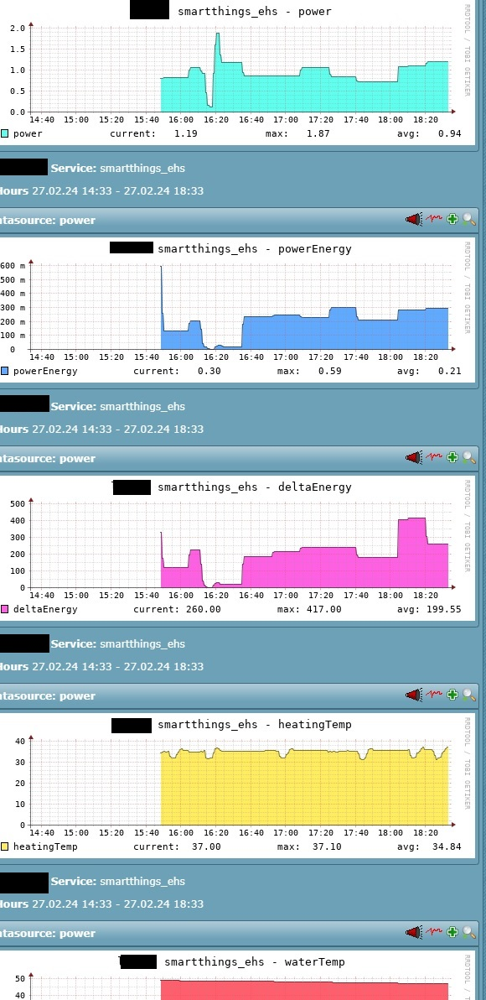

# check_mk_smartthings_ehs

Simple (DEMO) check_mk smartthings ehs temperatureMeasurementCheck

## e.g. for Samsung Electronics

- MIM-H04EN/DA-SAC-WIFIKIT-000001 with Subsystem Eco Heating System (EHS) / SAC_EHS_MONO (Quiet WP)

## check req.

- bash
- curl
- jq

## Script directory

See https://docs.checkmk.com/latest/en/localchecks.html#folders

## Test

```
chmod +x smartthings_ehs.sh
./smartthings_ehs.sh $bearerToken $deviceId
```

## SmartThings

### getBearerToken

See https://account.smartthings.com/tokens

### getDeviceId

See https://developer.smartthings.com/docs/api/public/#tag/Devices/operation/getDevices

### Simple Demo


