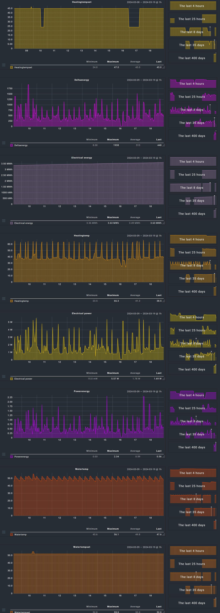

# check_mk_smartthings_ehs

Simple (DEMO) check_mk smartthings ehs temperatureMeasurementCheck

## e.g. for Samsung Electronics

- MIM-H04EN/DA-SAC-WIFIKIT-000001 with Subsystem Eco Heating System (EHS) / SAC_EHS_MONO (Quiet WP)

## check req.

- bash
- curl
- jq

## Script directory

See https://docs.checkmk.com/latest/en/localchecks.html#folders

## Test

```
chmod +x smartthings_ehs.sh
./smartthings_ehs.sh $bearerToken $deviceId
```

## SmartThings

### getBearerToken

See https://account.smartthings.com/tokens

### getDeviceId

See https://developer.smartthings.com/docs/api/public/#tag/Devices/operation/getDevices

### Simple Demo
RAW Edition

## v1.x


## v2.x


### Note

#### Tested on checkmk/check-mk-raw:latest
_Example_
```
version: '3.3'
services:
  check-mk-raw:
    ports:
      - 8722:5000
    tmpfs: /opt/omd/sites/cmk/tmp:uid=1000,gid=1000
    volumes:
      - /volume1/docker/checkmk/sites:/omd/sites
      - /volume1/docker/checkmk/check_mk_agent:/usr/lib/check_mk_agent:ro
      - /volume1/docker/checkmk/smartthings.conf:/etc/smartthings.conf:ro
      - /etc/localtime:/etc/localtime:ro

    container_name: checkmk
    restart: always
    image: checkmk/check-mk-raw:latest
```
